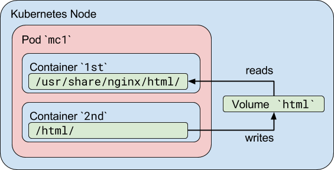
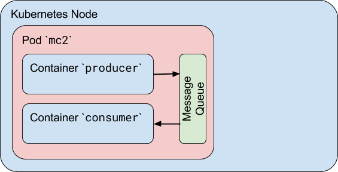
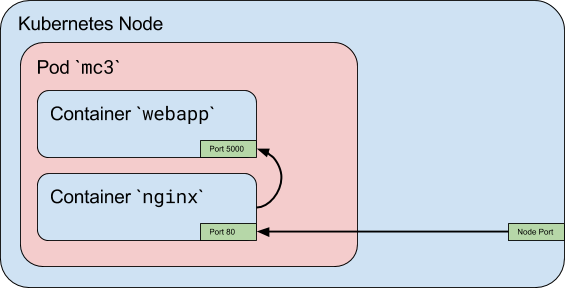

## Pod trong k8s

Container thường hướng tới giải quyết một vấn đề đơn lẻ, được xác định trong phạm vi hẹp, như là một microservice. 
Nhưng trong thế giới thực, các vấn đề đói hỏi nhiều container cho một giải pháp hoàn chỉnh. Trong bài viết này, chúng ta sẽ nói tới việc 
kết hợp nhiều container vào trong một Pod duy nhất của k8s, và nó có ý nghĩa gì đối với giao tiếp giữa các container.

## K8s Pod là gì

Hãy bắt đầu bằng việc giải thích Pod là gì? Pod là một đơn vị nhỏ nhất có thể được triển khai và quản lý bởi k8s. Nói cách khác, nếu bạn cần chạy 
một conainer duy nhất trong k8s, bạn cần tạo một Pod cho container đó. Đồng thời, một Pod có thể chứa nhiều hơn một container, thường là bởi 
vì các container này được kết hợp chặt chẽ với nhau. Chúng kết hợp chặt chẽ với nhau như thế nào? Vâng, hãy nghĩ về nó theo cách này, các container 
trong một pod đại diện cho các tiến trình mà có thể chạy trên cùng một máy chủ ở thế giới chưa có container.

Và điều đó có ý nghĩa,  trong nhiều khía cạnh, một Pod giống như một máy chủ duy nhất. Ví dụ, mỗi container có thể truy cập vào container khác 
trong một pod dưới dạng các cổng khác nhau trên một máy chủ cục bộ (localhost)

## Tại sao k8s sử dụng pod làm đơn vị triển khai nhỏ nhất mà không phải là một container duy nhất.

Mặc dù có vẻ đơn giản hơn khi triển khai trực tiếp một container đơn, có nhiều lý do chính đáng để thêm vào một lớp trừu tượng được đại diện 
bởi Pod. Một container là một thực thể tồn tại, tham chiếu tới một thứ cụ thể. Thứ cụ thể đó có thể là một Docker container, nhưng cũng có thể là một 
rkt container, hoặc một VM được quản lý bởi Virtlet. Mỗi thứ trong này có các yêu cầu khác nhau

Hơn nữa, để quản lý một container, K8s cần bổ sung thông tin, chẳng hạn như chính sách khởi động lại, xác định vấn đề cần làm với một container 
khi nó kết thúc (terminate), hoặc một liveness probe (chả hiểu nên chả dịch được, ai hiểu từ này giải thích hộ phát), cái mà định nghĩa một hành động 
để phát hiện nếu một tiến trình trong container vẫn còn sống theo quan điểm của ứng dụng, chẳng hạn như một web server phản hồi cho một HTTP request

Thay vì quá tải việc bổ sung thuộc tính cho những điều đã tồn tại, kỹ sư k8s đã quyết định sử dụng một thực thể mới, Pod, có chứa một hoặc nhiều 
container nên được quản lý như một thực thể duy nhất.

## Tại sao k8s cho phép nhiều hơn một container trong một pod

Các container trong một Pod chạy trên một "logical host", chúng sử dụng chung một namespace (nói cách khác, chung địa chỉ IP và port space), 
và cùng IPC namespace. Chúng có thể sử dụng chung volume được chia sẻ. Những đặc tính này là cho các container này có thể giao tiếp hiệu quả, 
đảm bảo data locality. Ngoài ra, Pod cho phép bạn quản lý nhiều container ứng dụng được kết hợp chặt chẽ lại dưới dạng một đơn vị duy nhất.

Vì vậy, nếu một ứng dụng cần vài container chạy trên cùng một host, tại sao không chỉ tạo một container duy nhất với mọi thứ bạn cần? Đầu tiên, 
bạn có thể vi phạm nguyên tắc "một process cho mỗi container". Điều này quan trọng vì với nhiều process trong một container, gây khó khăn cho 
việc khắc phục container, vì log từ các process khác nhau sẽ trộn lẫn vào nhau, và nó gây khó khăn hơn cho việc quản lý process lifecycle, ví dụ 
như quản lý "zombie processes" khi tiến trình cha (parent process) bị chết. Thứ hai, việc sử dụng một vài container cho một ứng dụng thì đơn 
giản hơn, minh bạch hơn, và cho phép decoupling software dependencied (ai dịch giúp phát). Ngoài ra, các container chi tiết hơn có thể sử dụng 
lại giữa các nhóm.

## Các trường hợp sử dụng Pod có nhiều container

Mục đích chính của Pod có nhiều container là hỗ trợ quản lý nhiều process trợ giúp cho một ứng dụng chính. Một số trường hợp (pattern) sử dụng 
process trợ giúp trong Pod:

- **Sidecar containers** giúp cho container chính. Ví dụ như theo dõi sự thay đổi của log hoặc data, giám sát,... Theo dõi log có thể được xây dựng một 
lần bởi một nhóm khác và được sử dụng lại trên các ứng dụng khác nhau. Một ví dụ khác về sidecar container là tải một file hoặc data được tạo ra bởi 
container chính.

- **Proxies, bridges, và adapters** kết hợp container chính với thế giới bên ngoài (external world). Ví dụ, một máy chủ Apache hoặc nginx phục vụ các 
static file. Nó có thể hoạt động như một reverse proxy với một web application trong container chính để ghi log và giới hạn HTTP requests. Một 
ví dụ khác là container trợ giúp định tuyến các yêu cầu từ container chính kết nối tới thế giới bên ngoài. Điều này là cho nó có thể cho container chính 
kết nối với localhost để truy cập, ví dụ, một cơ sở dữ liệu bên ngoài nhưng không có bất kỳ service discovery nào.

Mặc dù bạn có thể lưu trữ một multi-tier application (như WordPress) trong một Pod đơn, cách được khuyến nghị là sử dụng các Pod riêng biệt cho mỗi 
tier, vì lý do đơn giản là bạn có thể mở rộng các tầng độc lập và phân phối chúng trên các cluster nodes.

## Kết nối giữa các container trong một Pod

Việc cho nhiều container trong một Pod đơn khiến cho chúng tương đối đơn giản để giao tiếp với nhau. Chúng có thể là điều này 
bằng cách sử dụng một số phương pháp khác nhau.

### Chia sẻ volume trong một K8s Pod

Trong k8s, bạn có thể sử dụng một shared k8s volume một cách đơn giản và hiệu quả để chia sẻ dữ liệu giữa các container trong một Pod. Đối với 
hầu hết các trường hợp, nó là đủ để sử dụng một thư mục trên máy chủ được chia sẻ cho tất cả các container trong một Pod.

K8s Volume cho phép dữ liệu tồn tại khi khởi động lại một container, nhưng những volume này có cùng lifetime với Pod. Điều đó có nghĩa là 
volume (và dữ liệu trong đó) tồn tại tới chừng nào mà Pod còn tồn tại. Nếu Pod đó bị xoá vì bất kỳ lý do gì, ngay cả khi một thay thế giống hệt được 
tạo ra, shared volume cũng bị huỷ và được tạo lại.

Một trường hợp chuẩn cho việc sử dụng Pod nhiều container với một shared Volume là khi một container chứa log hoặc các tệp khác cho thư mục 
chung, và các container khác đọc từ thư mục chia sẻ. Ví dụ, chúng ta có thể viết một Pod như sau:

```sh
apiVersion: v1
kind: Pod
metadata:
  name: mc1
spec:
  volumes:
  - name: html
    emptyDir: {}
  containers:
  - name: 1st
    image: nginx
    volumeMounts:
    - name: html
      mountPath: /usr/share/nginx/html
  - name: 2nd
    image: debian
    volumeMounts:
    - name: html
      mountPath: /html
    command: ["/bin/sh", "-c"]
    args:
      - while true; do
          date >> /html/index.html;
          sleep 1;
        done
```

Trong ví dụ này, chúng ta xác định một tập có tên là html. Nó có kiểu là emptyDir, có nghĩa là volume được tạo lần đầu khi một Pod được gán 
cho một node, và tồn tại tới chúng nào Pod vẫn đang chạy trên node đó. Như tên gọi, ban đầu nó empty. Container đầu tiên chạy nginx server và 
chia sẻ volume gắn vào thư mục `/usr/share/nginx/html`. Container thứ 2 sử dụng Debian image và có shared volume được gắn vào thư mục `/html`. 
Mỗi giây, container thứ 2 thêm ngày giờ hiện tại vào file index.html nằm trong shared volume. Khi người dùng thực hiện yêu cầu HTTP tới Pod, 
Nginx server đọc tệp này và chuyển nó trở lại cho người dùng trong một response cho request.



Bạn có thể kiểm tra xem Pod có hoạt động hay không bằng cách exposing nginx port và truy cập nó từ browser của bạn hoặc bằng cách kiểm tra 
shared directory trực tiếp trong các container

```sh
$ kubectl exec mc1 -c 1st -- /bin/cat /usr/share/nginx/html/index.html
 ...
 Fri Aug 25 18:36:06 UTC 2017
 
 $ kubectl exec mc1 -c 2nd -- /bin/cat /html/index.html
 ...
 Fri Aug 25 18:36:06 UTC 2017
 Fri Aug 25 18:36:07 UTC 2017
```

### Inter-process communications (IPC)

Các container trong Pod chia sẻ cùng IPC namespace, có nghĩa là chúng có thể giao tiếp với nhau bằng cách sử dụng chuẩn IPC như 
SystemV semaphores hoặc POSIX shared memory.

Trong ví dụ sau, chúng ta định nghĩa một Pod có 2 container. Chúng ta sử dụng cùng một Docker image cho cả hai. Container đầu tiên, producer, 
tạo một hàng đợi thông điệp Linux chuẩn (standard Linux message queue), viết một số thông báo ngẫu nhiên, và sau đó viết một thông báo thoát 
đặc biệt. Container thứ 2, consumer, mở cùng message queue đó để đọc và đọc tin nhắn cho tới khi nó nhận được thông báo thoát (exit message). 
Chúng ta cùng thiết lập một chính sách khởi động lại (restart policy) là "Never", Pod sẽ dừng sau khi kết thúc cả 02 container.

```sh
apiVersion: v1
kind: Pod
metadata:
  name: mc2
spec:
  containers:
  - name: producer
    image: allingeek/ch6_ipc
    command: ["./ipc", "-producer"]
  - name: consumer
    image: allingeek/ch6_ipc
    command: ["./ipc", "-consumer"]
  restartPolicy: Never
```
 
 Để kiểm tra điều này, tạo pod bằng cách sử dụng kubectl tạo và xem trạng thái Pod
 
 ```sh
 $ kubectl get pods --show-all -w
NAME      READY     STATUS              RESTARTS  AGE
mc2       0/2       Pending             0         0s
mc2       0/2       ContainerCreating   0         0s
mc2       0/2       Completed           0         29
 ```
 
 Bây giờ, bạn có thể kiểm tra log cho mỗi container và xác minh rằng container thứ 2 nhận tất cả các message từ container thứ nhất, 
 bao gồm cả thông báo thoát (exit message):
 
 ```sh
 $ kubectl logs mc2 -c producer
...
Produced: f4
Produced: 1d
Produced: 9e
Produced: 27
$ kubectl logs mc2 -c consumer
...
Consumed: f4
Consumed: 1d
Consumed: 9e
Consumed: 27
Consumed: done
 ```
 
 
 
 Tuy nhiên, có một vấn đề lớn với Pod này và nó liên quan đến cách các container khởi động
 
 ### Container phụ thuộc và thứ tự khởi động
 
 Hiện tại, tất cả các container trong một Pod đang được khởi động song song và không có cách nào để xác định rằng một container phải 
 khởi động sau một container khác. Ví dụ, trong ví dụ về IPC, có khả nằng container thứ hai có thể hoàn thành việc khởi động trước khi container thứ 
 nhất khởi và tạo hàng đợi thông điệp xong. Trong trường hợp này, container thứ 2 sẽ bị lỗi, vì nó mong đợi rằng hàng đợi (message queue) đã tồn tại.
 
 Một số nỗ lực để cung cấp một số biện pháp kiểm soát cách container khởi động, như **Kubernetes Init Containers**, bắt đầu đầu tiên (và tuần tự), 
 đang được phát triển, nhưng trong môi trường cloud native, tốt hơn là lập kế hoạch cho các lỗi ngoài tầm kiểm soát của bạn. Ví dụ, một cách 
 để khắc phục sự cố này là thay đổi ứng dụng để chờ hàng đợi tin nhắn được tạo.
 
 ### Inter-container network communication
 
 Các container trong một Pod có thể được truy cập thông qua "localhost"; chúng sử dụng cùng một network namespace. Ngoài ra, đối với các container, 
 hostname được nhìn thấy là tên của Pod. Bởi vì container chia sẻ cùng một địa chỉ IP và port space, bạn nên sử dụng các port khác nhau trong container 
 cho các kết nối đến (incoming). Nói cách khác, các ứng dụng trong một Pod phải phối hợp việc sử dụng port của chúng.
 
 Trong ví dụ sau, chúng ta sẽ tạo một Pod có nhiều container, trong đó nginx trong một container làm việc như một reverse proxy cho ứng dụng web 
 đơn giản ở container thứ hai.
 
 **Bước 1**: Tạo một ConfigMap với tập tin cấu hình nginx. Các yêu cầu HTTP đến cổng 80 sẽ được chuyển tiếp đến cổng 5000 trên localhost:
 
 ```sh
 apiVersion: v1
kind: ConfigMap
metadata:
  name: mc3-nginx-conf
data:
  nginx.conf: |-
    user  nginx;
    worker_processes  1;

    error_log  /var/log/nginx/error.log warn;
    pid        /var/run/nginx.pid;

    events {
        worker_connections  1024;
    }

    http {
        include       /etc/nginx/mime.types;
        default_type  application/octet-stream;

        sendfile        on;
        keepalive_timeout  65;

        upstream webapp {
            server 127.0.0.1:5000;
        }

        server {
            listen 80;

            location / {
                proxy_pass         http://webapp;
                proxy_redirect     off;
            }
        }
    }
 ```
 
 **Bước 2**:  Tạo một Pod chứa nhiều container với ứng dụng web đơn giản và nginx trong các container riêng biệt. Lưu ý rằng đồi với Pod, 
 chúng ta chỉ định nghĩa Port 80, Port 5000 sẽ không thể truy cập được bên ngoài Pod.
 
 ```sh
 apiVersion: v1
kind: Pod
metadata:
  name: mc3
  labels:
    app: mc3
spec:
  containers:
  - name: webapp
    image: training/webapp
  - name: nginx
    image: nginx:alpine
    ports:
    - containerPort: 80
    volumeMounts:
    - name: nginx-proxy-config
      mountPath: /etc/nginx/nginx.conf
      subPath: nginx.conf
  volumes:
  - name: nginx-proxy-config
    configMap:
      name: mc3-nginx-conf
 ```
 
 **Bước 3**:  Expose cho Pod sử dụng dịch vụ NodePort
 
 ```sh
 $ kubectl expose pod mc3 --type=NodePort --port=80
service "mc3" exposed
 ```
 
 **Bước 4**: Xác định port trên node được sử dụng để chuyển tiếp cho Pod
 
 ```sh
 $ kubectl describe service mc3
...
NodePort:	<unset>	31418/TCP
...
 ```
 
 Bây giờ bạn có thể sử dụng trình duyệt (hoặc curl) để điều hướng đến port của node để truy cập ứng dụng web thông qua reverse proxy, như sau:
 
 ```sh
 http://myhost:31418
 ```
 
 Request này sau đó được chuyển tiếp (forward) tới port 5000 của webapp container.
 
 
 
### Exposing multiple container in a Pod
 
 Trong ví dụ này cho thấy cách sử dụng một container duy nhất để truy cập các container khác trong Pod, nó khá phổ biến đối với một số container 
 trong một port để listen trên các port khác nhau - tất cả đều cần được exposed. Để thực hiện điều này, bạn có thể tạo một dịch vụ đơn lẻ (single service) 
 với nhiều port được exposed, hoặc bạn có thể tạo một dịch vụ duy nhất (single service) cho mọi port bạn đang cố gắng exposed.
 
## Where to go from here

Bằng cách tạo Pod, k8s cung cấp rất nhiều tính linh hoạt để phối hợp cách thức hoạt động của container và cách giao tiếp giữa container với nhau. 
Chúng có thể chia sẻ file volume, chúng có thể giao tiếp thông qua mạng, và chúng thậm chí có thể giao tiếp bằng cách sử dụng IPC.

Tất nhiên, đó mới chỉ là sự khởi đầu. Bạn thích thú với việc xem có thể làm gì khác và thực hành nhiều hơn với k8s? Hãy tiếp tục tham khảo các bài viết 
trong chủ đề này.
 
## Tham khảo

- [https://www.mirantis.com/blog/multi-container-pods-and-container-communication-in-kubernetes/](https://www.mirantis.com/blog/multi-container-pods-and-container-communication-in-kubernetes/)
