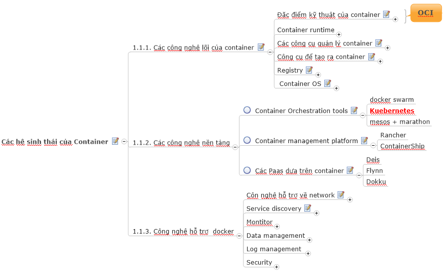

## Giới thiệu về Kubernetes

Trong hệ sinh thái của container có 03 phần chính, bao gồm

 - Phần 1: Đây là thành phần cơ bản và cốt lõi nhất trong hệ sinh thái container, các thành phần này bao gồm: Kiến trúc lõi của container (các khái niệm về runtime spec, image format speck); khái niệm images, network và storage.
 - Phần 2: Các công nghệ về platform liên quan tới container, bao gồm: các sản phẩm để orchestration container (sử dụng để khởi tạo các container theo các cơ chế điều phối), nền tảng để quản lý các container và các nền tảng PaaS dựa trên container.
 - Phần 3: Các công nghệ hỗ trợ container, bao gồm: công nghệ hỗ trợ khi triển khai container trên nhiều máy chủ vật lý, các giải pháp phụ trợ về thu thập log và gaims sát.
 

 
- Kubernetes là một sản phẩm nằm trong phần 2 của hệ sinh thái của container hiện nay. Nó đóng vai trò là là một công cụ orchestration (tạo ra, điều phối và chỉ huy các container) - nôm na mà nói thì kubernetes là thằng túm đầu các máy vật lý hoặc máy ảo cài đặt các môi trường để thực hiện docker.

## Các thông tin khởi đầu với Kubernetes 

### Cần chuẩn bị gì khi tìm hiểu về Kubernetes
- Để tìm hiểu tốt về Kubernetes thì cần tìm hiểu về hệ sinh thái container và docker ở mức cở bản (có nghĩa là cái cắm và thực hành được với docker cơ bản). Tài liệu về docker cơ bản ở đây (link)
- Kỹ năng và kiến thức tối quan trọng khi làm việc với Kubernetes là: Linux, Linux và Linux.
- Kỹ năng bổ trợ khác: Network (TCP/IP), một vài kỹ năng cài đặt các ứng dụng cơ bản như web server, database.
- Đối tượng người dùng thích hợp khi tìm hiểu Kubernetes: Sinh viên IT, các sysadmin, các lập trình viên và xa hơn nữa là bất kỳ ai có nhu cầu tìm hiểu.
- Cần vừa đọc khái niệm lý thuyết vừa thực hành.
- Tài liệu chuẩn của Kubernetes tất nhiên là ở trang chủ của họ https://kubernetes.io/, ngoài ra github này cũng coi như là một tham khảo tốt.

### Các thông tin tóm tắt về Kubernetes

- Khơi mào cho Kubernetes là anh Google.
- Kubernetes được dân chuyên môn hay viết tắt là K8S, tra từ điển ENG-VIETNAM thì không có nghĩa của từ này :). Trong các tài liệu này sẽ dùng từ K8S cho nhanh gọn nhé.
- Kubernetes là một `orchestration tools` trong hệ sinh thái của container (có nghĩa còn các thứ khác tương đương hay là đối thủ của nó). Tóm lại nó là thằng để tạo, sửa, xóa, thay đổi, thêm bớt ... các container.
- Kubernetes triển khai phù hợp với các công ty (hoặc ứng dụng)
  - Với nhiều máy chủ vật lý (trên 3 hoặc 5) có container engine (nghĩa là có sử dụng container), hoặc các hệ thống chạy trên môi trường với số lượng container rất lớn lên đến vài trăm chẳng hạn.
  - Thích hợp với những ứng dụng có kiến trúc microservice hay cloud native app.
  - Thích hợp với các ứng dụng có nhu cầu scale khi có tải lớn (scale phải tự động chứ không chơi `au tu mây cơm ` nhé. Đại ý là khi số lượng request tăng lên thì các container được quản lý bởi K8S sẽ tự động sinh ra hoặc khi 1 trong số các container bị down thì K8S tự động biết và bổ sung chẳng hạn.
  - Các sysadmin, developer ... cty muốn tự động hóa các nhu cầu cài đặt, triển khai hoặc tích hợp các giải pháp về CI/CD (google thêm cái CI/CD này nhá, mình chỉ thấy nó hay được dùng cho các giải pháp này thôi).
  - Kubernetes có thể cài đặt trên 1 node hoặc nhiều node (máy chủ - tính cả vật lý, máy ảo, các máy trên các cloud Provider ...). Và chắc chắn Kubernetes cũng có rất nhiều cách cài đặt khác nhau, mỗi cách cài đặt thì lại phù hợp với các đối tượng (hay chính xác hơn là skill của đối tượng) hoặc các mô hình hoặc các môi trường (Môi trường thử nghiệm, môi trường dùng để demo hay đánh giá, môi trường production - chạy sản phẩm thật).
  - Kubernetes có nhiều thành phần và khái niệm, cần tìm hiểu cẩn thận và hiểu rõ để thuận lợi hơn cho bạn khi làm việc với Kubernetes.
  
### Các cách cài đặt K8S

K8S có rất nhiều thành phần ở bên trong (sẽ nói từng thành phần ở sau) do vậy nó cũng có dăm ba cách cài đặt khác nhau, các cách cài tùy ngữ cảnh mà áp dụng. Ví dụ với beginer thì dùng cách A, với Master thì dùng cách B, với Siêu nhân thì dùng các C hoặc các nào cũng được, tóm lại có các cách cài như sau nhé (bạn tự sắp xếp khả năng của bạn để lựa chọn cách cài cho hợp lý, note này tôi dựa vào skill của tôi để phân loại).

- Minikube: Là một tools do chính Kubernetes phát triển, mục tiêu của nó là theo kiểu mỳ ăn liền - cài 

