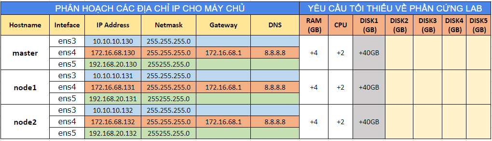

## Cài đăt Kubernetes 

### 1. Môi trường
- Ubuntu 16.04 - 64 bit (3 node: 01 Node k8s-master, 02 node k8s-node1 & k8s-node2)
- Docker version Docker version 1.13.1, build 092cba3
- Kubernetes version v1.9.2

`Lưu ý`: Tài liệu thực hành này có ý nghĩa nhất với các phiên bản được kể tên ở trên, các phiên bản khác hoặc cũ hơn của từng thành phần sẽ cần có hướng dẫn khác hoặc chưa chắc chắn các bước thực hiện như tài liệu này.


### 2. Mô hình & IP Planning

#### 2.1. Mô hình: 


- File topology online được cung cấp ở [link  này](https://www.draw.io/#G1NmTeK-k590hew0GikQcl_TNiwO1nDjxK)

#### 2.2. IP Planning:



- Lưu ý: Mặc dù trong bảng trên ta có 03 NICs cho mỗi máy nhưng trong các bước hướng dẫn này ta chỉ cần sử dụng interface có dải `172.16.68.0/24`. Các dải còn lại là do hạ tầng của tôi và tôi chuẩn bị sẵn để cho các mục tiêu khác. Do vậy để làm theo LAB này bạn chỉ mỗi máy có 01 NIC là được. Hãy thay lại IP cho phù hợp với môi trường của bạn nhé.
 
### 3. Bước chuẩn bị

Đặt hostname, IP cho tất cả các node theo IP Planning
- SSH với tài khoản `root` và thực hiện.

#### 3.1. Đặt hostname và ip cho node `k8s-master`
- Thực hiện update và cài các gói bổ trợ cho OS.

  ```sh
  apt-get -y update
  apt-get -y install -y vim curl wget 
  apt-get -y install byobu
  ```

- Đặt ip cho node `k8s-master` bằng cách chạy lệnh dưới để sửa file file `/etc/network/interfaces`

  ```sh
  cat << EOF > /etc/network/interfaces
  # This file describes the network interfaces available on your system
  # and how to activate them. For more information, see interfaces(5).

  source /etc/network/interfaces.d/*

  # The loopback network interface
  auto lo
  iface lo inet loopback

  # The primary network interface
  auto ens4
  iface ens4 inet static
  address 172.16.68.130
  netmask 255.255.255.0
  gateway 172.16.68.1
  dns-nameservers 8.8.8.8
  EOF

- Đặt hostname cho máy `k8s-master` bằng cách sửa nội dung các file `/etc/hosts` và `/etc/hostname`
  - Chạy lệnh dưới để khai báo hostname cho `k8s-node1`
    ```sh
    cat << EOF > /etc/hosts
    127.0.0.1       localhost k8s-master
    172.16.68.130       k8s-master
    172.16.68.131       k8s-k8s-node1
    172.16.68.132       k8s-node2
    EOF
    ```
    
  - File `/etc/hostname` được sửa bằng lệnh dưới.
    ```sh
    echo k8s-master > /etc/hostname
    ```
    
- Khởi động lại node k8s-master
  ```sh
  init 6
  ```

#### 3.1. Đặt hostname và ip cho node `k8s-node1`
- Thực hiện update và cài các gói bổ trợ cho OS.

  ```sh
  apt-get -y update
  apt-get -y install -y vim curl wget 
  apt-get -y install byobu
  ```

- Đặt ip cho node `k8s-node1` bằng cách chạy lệnh dưới để sửa file file `/etc/network/interfaces`

  ```sh
  cat << EOF > /etc/network/interfaces
  # This file describes the network interfaces available on your system
  # and how to activate them. For more information, see interfaces(5).

  source /etc/network/interfaces.d/*

  # The loopback network interface
  auto lo
  iface lo inet loopback

  # The primary network interface
  auto ens4
  iface ens4 inet static
  address 172.16.68.131
  netmask 255.255.255.0
  gateway 172.16.68.1
  dns-nameservers 8.8.8.8
  EOF
  ```

- Đặt hostname cho máy `k8s-master` bằng cách sửa nội dung các file `/etc/hosts` và `/etc/hostname`
  - Chạy lệnh dưới để khai báo hostname cho `k8s-node1`
    ```sh
    cat << EOF > /etc/hosts
    127.0.0.1       localhost k8s-node1
    172.16.68.130       k8s-master
    172.16.68.131       k8s-node1
    172.16.68.132       k8s-node2
    EOF
    ```
    
    ```sh
    echo k8s-node1 > /etc/hostname
    ```
    
- Khởi động lại `k8s-node1`
  ```sh
  init 6
  ```

#### 3.2. Đặt hostname và ip cho node `k8s-node2`
- Thực hiện update và cài các gói bổ trợ cho OS.

  ```sh
  apt-get -y update
  apt-get -y install -y vim curl wget 
  apt-get -y install byobu
  ```

- Đặt ip cho node `k8s-node2` bằng cách chạy lệnh dưới để sửa file file `/etc/network/interfaces`

  ```sh
  cat << EOF > /etc/network/interfaces
  # This file describes the network interfaces available on your system
  # and how to activate them. For more information, see interfaces(5).

  source /etc/network/interfaces.d/*

  # The loopback network interface
  auto lo
  iface lo inet loopback

  # The primary network interface
  auto ens4
  iface ens4 inet static
  address 172.16.68.132
  netmask 255.255.255.0
  gateway 172.16.68.1
  dns-nameservers 8.8.8.8
  EOF
  ```

- Đặt hostname cho máy `k8s-master` bằng cách sửa nội dung các file `/etc/hosts` và `/etc/hostname`
  - Chạy lệnh dưới để khai báo hostname cho `k8s-node2`
    ```sh
    cat << EOF > /etc/hosts
    127.0.0.1       localhost k8s-node2
    172.16.68.130       k8s-master
    172.16.68.131       k8s-node1
    172.16.68.132       k8s-node2
    EOF
    ```
    
  - File `/etc/hostname` được sửa bằng lệnh dưới.
    ```sh
    echo k8s-node2 > /etc/hostname
    ```
    
- Khởi động lại `k8s-node2`
  ```sh
  init 6
  ```

### 4. Cài đặt docker và các thành phần cần thiết của K8S.
Trên tất cả các node sẽ cài các thành phần: `docker, kubelet, kubeadm và kubectl`. Trong đó:
- `docker`: để làm môi trường chạy các container.
- `kubeadm`: Được sử dụng để thiết lập cụm cluster cho K8S. (Cluster là một cụm máy thực hiện chung một mục đích). Các tài liệu chuyên môn gọi `kubeadm` là bột bootstrap (bootstrap tạm hiểu một tools đóng gói để tự động làm việc gì đó)
- `kubelet`: Là thành phần chạy trên các host, có nhiệm vụ kích hoạt các pod và container trong cụm Cluser của K8S.
- `kubectl`: Là công cụ cung cấp CLI (Giao diện dòng lệnh) để tương tác với K8S.

#### 4.1. Cài đặt docker trên tất cả các node 

```sh
apt-get update && apt-get install docker.io
```

#### 4.2. Cài đặt các thành phần của K8S trên tất cả các node.

- Cài đặt trên tất cả các node  

```sh
apt-get update && apt-get install -y apt-transport-https

curl -s https://packages.cloud.google.com/apt/doc/apt-key.gpg | apt-key add 

cat <<EOF >/etc/apt/sources.list.d/kubernetes.list
deb http://apt.kubernetes.io/ kubernetes-xenial main
EOF

apt-get update  -y
apt-get install -y kubelet kubeadm kubectl
```


#### 4.3 Thiết lập cluster 

- Đứng trên node `k8s-master` thực hiện lệnh dưới để thiết lập cluster

  ```sh
  kubeadm init --apiserver-advertise-address 172.16.68.130 --pod-network-cidr=10.244.0.0/16
  ```
  
- Trong đó:
  - `172.16.68.130`: là IP của node k8s-master
  
- Luư ý: Nếu gặp thông báo lỗi `[ERROR Swap]: running with swap on is not supported. Please disable swap`   khi thực hiện `kubeadm init` thì cần thực hiện lệnh `swapoff -a`. Sau đó thực hiện lại lệnh ở trên.

- Kết quả của lệnh trên như bên dưới hoặc như ảnh http://prntscr.com/i5icxv

  ```sh
  root@k8s-master:~#   kubeadm init --apiserver-advertise-address 172.16.68.130 --pod-network-cidr=10.244.0.0/16
  [init] Using Kubernetes version: v1.9.2
  [init] Using Authorization modes: [Node RBAC]
  [preflight] Running pre-flight checks.
          [WARNING FileExisting-crictl]: crictl not found in system path
  [certificates] Generated ca certificate and key.
  [certificates] Generated apiserver certificate and key.
  [certificates] apiserver serving cert is signed for DNS names [k8s-master kubernetes kubernetes.default kubernetes.default.svc kubernetes.default.svc.cluster.local] and IPs [10.96.0.1 172.16.68.130]
  [certificates] Generated apiserver-kubelet-client certificate and key.
  [certificates] Generated sa key and public key.
  [certificates] Generated front-proxy-ca certificate and key.
  [certificates] Generated front-proxy-client certificate and key.
  [certificates] Valid certificates and keys now exist in "/etc/kubernetes/pki"
  [kubeconfig] Wrote KubeConfig file to disk: "admin.conf"
  [kubeconfig] Wrote KubeConfig file to disk: "kubelet.conf"
  [kubeconfig] Wrote KubeConfig file to disk: "controller-manager.conf"
  [kubeconfig] Wrote KubeConfig file to disk: "scheduler.conf"
  [controlplane] Wrote Static Pod manifest for component kube-apiserver to "/etc/kubernetes/manifests/kube-apiserver.yaml"
  [controlplane] Wrote Static Pod manifest for component kube-controller-manager to "/etc/kubernetes/manifests/kube-controller-manager.yaml"
  [controlplane] Wrote Static Pod manifest for component kube-scheduler to "/etc/kubernetes/manifests/kube-scheduler.yaml"
  [etcd] Wrote Static Pod manifest for a local etcd instance to "/etc/kubernetes/manifests/etcd.yaml"
  [init] Waiting for the kubelet to boot up the control plane as Static Pods from directory "/etc/kubernetes/manifests".
  [init] This might take a minute or longer if the control plane images have to be pulled.
  [apiclient] All control plane components are healthy after 56.503430 seconds
  [uploadconfig] Storing the configuration used in ConfigMap "kubeadm-config" in the "kube-system" Namespace
  [markk8s-master] Will mark node k8s-master as k8s-master by adding a label and a taint
  [markk8s-master] k8s-master k8s-master tainted and labelled with key/value: node-role.kubernetes.io/k8s-master=""
  [bootstraptoken] Using token: 1aeb1d.89a15bf6272c8274
  [bootstraptoken] Configured RBAC rules to allow Node Bootstrap tokens to post CSRs in order for nodes to get long term certificate credentials
  [bootstraptoken] Configured RBAC rules to allow the csrapprover controller automatically approve CSRs from a Node Bootstrap Token
  [bootstraptoken] Configured RBAC rules to allow certificate rotation for all node client certificates in the cluster
  [bootstraptoken] Creating the "cluster-info" ConfigMap in the "kube-public" namespace
  [addons] Applied essential addon: kube-dns
  [addons] Applied essential addon: kube-proxy

  Your Kubernetes k8s-master has initialized successfully!

  To start using your cluster, you need to run the following as a regular user:

    mkdir -p $HOME/.kube
    sudo cp -i /etc/kubernetes/admin.conf $HOME/.kube/config
    sudo chown $(id -u):$(id -g) $HOME/.kube/config

  You should now deploy a pod network to the cluster.
  Run "kubectl apply -f [podnetwork].yaml" with one of the options listed at:
    https://kubernetes.io/docs/concepts/cluster-administration/addons/

  You can now join any number of machines by running the following on each node
  as root:

    kubeadm join --token 1aeb1d.89a15bf6272c8274 172.16.68.130:6443 --discovery-token-ca-cert-hash sha256:cb8e0cd1238dc8fe8b1b2f16fe02817425005f04a8ddd09a7c19db08b75f72eb

  root@k8s-master:~#
  ```

- Quan sát của sổ ssh và thực hiện theo thông báo, thực hiện tiếp trên node `k8s-master` để cấu hình `kubectl` cho node k8s-master.

- Tới bước này ta có 02 lựa chọn để thao tác với K8S, lựa chọn 1 là sử dụng tài khoản `root`, lựa chọn 2 là sử dụng một tài khoản khác, hướng dẫn này là tài khoản `ubuntu`.

#### Lựa chon 1: Sử dụng tài khoản `root` để thao tác với `K8S`
- Trong mỗi phiên ssh bằng tài khoản `root`, để sử dụng được lệnh của K8S thì cần thực hiện lệnh dưới để khai báo các biến môi trường

  ```sh
  export KUBECONFIG=/etc/kubernetes/admin.conf
  ```
    - Sau đó có thể thao tác các với các lệnh của K8S ở bên dưới sau khi hoàn tất việc cài đặt.

- Hoặc khai báo cố định biến môi trường bằng các lệnh dưới đây. Lúc này ta không cần thực hiện export như ở trên nữa.

	```
	mkdir -p $HOME/.kube
	sudo cp -i /etc/kubernetes/admin.conf $HOME/.kube/config
	sudo chown $(id -u):$(id -g) $HOME/.kube/config
	```
    
#### Lựa chon 2: Sử dụng một tài khoản khác tài khoản `root`
- Tạo user `ubuntu` để thực hiện cấu hình cho K8S. Nếu có user trước đó rồi thì không cần thực hiện bước này.

  ```sh
  adduser ubuntu
  ```

- Nhập thông tin và mật khẩu cho user `ubuntu`, sau đó phân quyền sudoer bằng lệnh dưới.

  ```sh
  echo "ubuntu ALL=(ALL) NOPASSWD: ALL" >> /etc/sudoers
  ```
  
- Chuyển sang user ubuntu để thực hiện.

  ```sh
  su - ubuntu
  mkdir -p $HOME/.kube
  sudo cp -i /etc/kubernetes/admin.conf $HOME/.kube/config
  sudo chown $(id -u):$(id -g) $HOME/.kube/config
  ```

- Sử dụng thủ thuật dưới để thao tác lệnh trong k8s được thuận lợi hơn nhờ việc tư động hoàn thiện lệnh mỗi khi thao tác.

```sh
echo "source <(kubectl completion bash)" >> ~/.bashrc
```

#### 4.4 Cài đặt Pod Network 

- Đứng trên node k8s-master cài đặt Pod network.
- K8S có nhiều lựa chọn cho giải pháp network để kết nối các container, trong hướng dẫn này chúng tôi sử dụng `flannel`

  ```sh
  kubectl apply -f https://raw.githubusercontent.com/coreos/flannel/k8s-master/Documentation/kube-flannel.yml
  ```

  - Kết quả của lệnh trên như sau: 

    ```sh
    ubuntu@k8s-master:~$ kubectl apply -f https://raw.githubusercontent.com/coreos/flannel/k8s-master/Documentation/kube-flannel.yml
    clusterrole "flannel" created
    clusterrolebinding "flannel" created
    serviceaccount "flannel" created
    configmap "kube-flannel-cfg" created
    daemonset "kube-flannel-ds" created
    ubuntu@k8s-master:~$
    ````

- Từ bản 1.9 trở lên, thực hiện lệnh dưới để tạo token trên node k8s-master, kết quả trả vê được sử dụng để thực hiện trên các k8s-node1 và k8s-node2

  ```sh
   sudo kubeadm token create --print-join-command
  ```
  - Kết quả như bên dưới, lưu giá trị trong cột token để sử dụng cho việc join các k8s-node1 và k8s-node2 vào cụm cluster:
    ```sh
    kubeadm join --token 150984.0da1fe160e5113f0 172.16.68.130:6443 --discovery-token-ca-cert-hash sha256:cb8e0cd1238dc8fe8b1b2f16fe02817425005f04a8ddd09a7c19db08b75f72eb
    ```
- Sau đó dùng kết quả trên để copy và thực hiện trên các k8s-node1 và k8s-node2.
    
#### 4.5. Thực hiện join `k8s-node1` và `k8s-node2` vào cluster
- Đứng trên cả `k8s-node1` và `k8s-node2` thực hiện 
  ```sh
  kubeadm join --token 150984.0da1fe160e5113f0 172.16.68.130:6443 --discovery-token-ca-cert-hash sha256:cb8e0cd1238dc8fe8b1b2f16fe02817425005f04a8ddd09a7c19db08b75f72eb
  ````
  
- Lưu ý: Nếu có thông báo `[ERROR Swap]: running with swap on is not supported. Please disable swap` khi thực hiện lệnh join thì sử dụng lệnh dưới và thực hiện lại lệnh join.
  ```sh
  swapoff -a
  ```
  
- Kết quả trả về là:
  ```sh
  [preflight] Running pre-flight checks.
          [WARNING FileExisting-crictl]: crictl not found in system path
  [discovery] Trying to connect to API Server "172.16.68.130:6443"
  [discovery] Created cluster-info discovery client, requesting info from "https://172.16.68.130:6443"
  [discovery] Requesting info from "https://172.16.68.130:6443" again to validate TLS against the pinned public key
  [discovery] Cluster info signature and contents are valid and TLS certificate validates against pinned roots, will use API Server "172.16.68.130:6443"
  [discovery] Successfully established connection with API Server "172.16.68.130:6443"

  This node has joined the cluster:
  * Certificate signing request was sent to k8s-master and a response
    was received.
  * The Kubelet was informed of the new secure connection details.

  Run 'kubectl get nodes' on the k8s-master to see this node join the cluster.
  root@k8s-node1:~#
  ```

- `Lưu ý`: là cần thực hiện trên cả 02 node `k8s-node1` và `k8s-node2`

- Sau khi thực hiện join cả 02 `k8s-node1` và `k8s-node2` thì quay lại node `k8s-master` để kiểm tra các node xem đã join được hay chưa.
  ```sh
  export KUBECONFIG=/etc/kubernetes/admin.conf
  kubectl get nodes
  ```

- Kết quả trả về của lệnh trên như sau.
  ```sh
  NAME      STATUS    ROLES     AGE       VERSION
  k8s-master    Ready     k8s-master    9h        v1.9.2
  k8s-node1     Ready     <none>    8h        v1.9.2
  k8s-node2     Ready     <none>    6m        v1.9.2
  ```

Chúng ta có thể thấy ở cột `STATUS` đã có trạng thái `Ready`. Tiếp tục thực hiện hiện lệnh dưới để download hoặc kiểm tra trạng thái của các thành phần trong K8S trên các node đã hoạt động hay chưa.

  ```sh
  kubectl get pod --all-namespaces
  ```

- Kết quả như bên dưới là ok (kiểm tra cột `STATUS`). 

  ```sh
  NAMESPACE     NAME                             READY     STATUS    RESTARTS   AGE
  kube-system   etcd-k8s-master                      1/1       Running   0          9h
  kube-system   kube-apiserver-k8s-master            1/1       Running   0          9h
  kube-system   kube-controller-manager-k8s-master   1/1       Running   0          9h
  kube-system   kube-dns-6f4fd4bdf-ctxx7         3/3       Running   0          9h
  kube-system   kube-flannel-ds-kjnhs            1/1       Running   0          9h
  kube-system   kube-flannel-ds-wz648            1/1       Running   0          8h
  kube-system   kube-flannel-ds-xtcj9            1/1       Running   0          36m
  kube-system   kube-proxy-5slwp                 1/1       Running   0          36m
  kube-system   kube-proxy-5trrj                 1/1       Running   0          9h
  kube-system   kube-proxy-b54bs                 1/1       Running   0          8h
  kube-system   kube-scheduler-k8s-master            1/1       Running   0          9h
  ```

- Trong một vài trường hợp cột `STATUS` sẽ có trạng thái `Pending, ContainerCreating,ImagePullBackOf` đối với một số thành phần, có thể chờ hoặc kiểm tra bằng lệnh `kubectl describe pod <ten_pod> --namespace=kube-system` , ở đây tên pod được lấy từ cột `NAME`.
  
export KUBECONFIG=/etc/kubernetes/admin.conf
kubectl describe pod kube-scheduler-k8s-master --namespace=kube-system

- Kết quả: http://paste.openstack.org/raw/653532/
  
Tới đây chúng ta đã có môi trường để bắt đầu thực hành với K8S rồi. Sau phần này chúng ta nên đọc sang phần các khái niệm trong K8S trước khi đi vào thực hành chi tiết hơn.


### Chạy thử ứng dụng 


Chạy thử ứng dụng là ngnix để kiểm tra hoạt động của cụm cluster. Trong lệnh này sẽ tạo ra 02 container chạy nginx và tự động phân tán trên các node k8s-node1 và k8s-node2. 

	```sh
	kubectl run test-nginx --image=nginx --replicas=2 --port=80
	```

  - Kết quả của lệnh trên: http://prntscr.com/jd7mj9 
  
Kiểm tra xem trang thái của các container 

	```sh
	kubectl get pods -o wide
	```

  - Kết quả của lệnh trên:  http://prntscr.com/jd7nol (lưu ý cột STATUS và NODE)

Đối với lệnh trên ta chỉ có thể truy cập vào web server nginx sẽ được tạo trong các container bằng các địa chỉ private vì port chưa được ánh xạ ra ngoài, nếu muốn sử dụng IP của các máy k8s-k8s-master, k8s-k8s-node1, k8s-k8s-node2 thì ta cần sử dụng tùy chọn sau

	```sh
	kubectl expose deploy test-nginx --port 80 --target-port 80 --type NodePort
	```

  - Tuy nhiên, port 80 ở trên chỉ là port để các node ánh xạ tới, muốn biết port để kết hợp với địa chỉ IP của các node ta cần xem trong dòng NodePort http://prntscr.com/jd84mp ở kết quả của lệnh dưới.

Kiểm tra thông tin sau khi deploy

	```sh
	kubectl describe service test-nginx
	```

  - Kết quả sẽ hiện thị thông tin của các ứng dụng đã được deploy: http://prntscr.com/jd7otc .
  - Có thể chuyển sang các node k8s-k8s-node1 và k8s-k8s-node2 để kiểm tra các container bằng lệnh docker ps 
 
Để delete ứng dụng vừa tạo ta sử dụng các lệnh dưới

	```sh
	kubectl delete service test-nginx

	kubectl delete deployment test-nginx
	```

Sau đó kiểm tra lại bằng lệnh 

	```sh
	kubectl get services
	kubectl get deployments
	```

Tới đây việc dựng cụm cluster K8S đã hoàn tất, chuyển sang các bước tìm hiểu nâng cao nhé.

