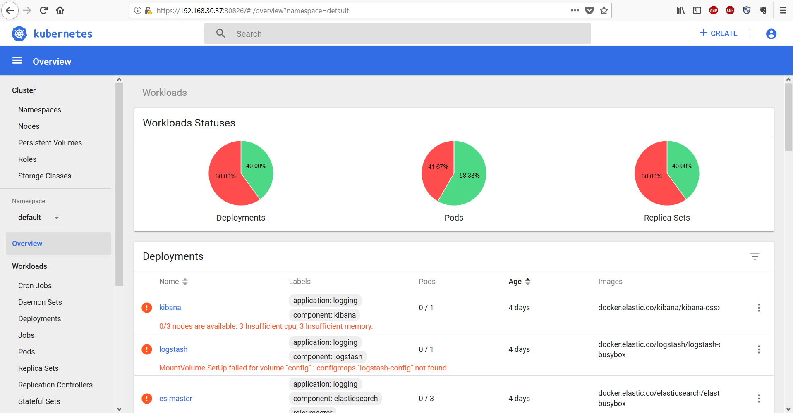

## Cài đăt Kubernetes 

### 1. Môi trường
- Ubuntu 16.04 - 64 bit (3 node: 01 Node k8s-master, 02 node k8s-node1 & k8s-node2)
- Docker version Docker version 1.13.1, build 092cba3
- Kubernetes version v1.9.2

`Lưu ý`: Tài liệu thực hành này có ý nghĩa nhất với các phiên bản được kể tên ở trên, các phiên bản khác hoặc cũ hơn của từng thành phần sẽ cần có hướng dẫn khác hoặc chưa chắc chắn các bước thực hiện như tài liệu này.


### 2. Mô hình & IP Planning

#### 2.1. Mô hình: 


- File topology online được cung cấp ở [link  này](https://www.draw.io/#G1NmTeK-k590hew0GikQcl_TNiwO1nDjxK)

#### 2.2. IP Planning:


- Lưu ý: Mặc dù trong bảng trên ta có 03 NICs cho mỗi máy nhưng trong các bước hướng dẫn này ta chỉ cần sử dụng interface có dải `172.16.68.0/24`. Các dải còn lại là do hạ tầng của tôi và tôi chuẩn bị sẵn để cho các mục tiêu khác. Do vậy để làm theo LAB này bạn chỉ mỗi máy có 01 NIC là được. Hãy thay lại IP cho phù hợp với môi trường của bạn nhé.
 
### 3. Bước chuẩn bị

Đặt hostname, IP cho tất cả các node theo IP Planning
- SSH với tài khoản `root` và thực hiện.

#### 3.1. Đặt hostname và ip cho node `k8s-master`

- Thực hiện update và cài các gói bổ trợ cho OS.

  ```sh
  apt-get update -y && apt-get upgrade -y
  apt-get -y install -y vim curl wget 
  apt-get -y install byobu
  ```
Tắt tính năng swap của OS.

- Do K8S không hỗ trợ swap nên cần phải tắt swap nếu như trong lúc cài OS bạn đã cấu hình, các bước như sau.
Thực hiện lệnh

	```sh
	swapoff -a
	````

- Mở file `/etc/fstab` và comment dòng swap lại như ảnh: http://prntscr.com/jd638u 
- Kiểm tra lại bằng lệnh `free -m` nếu dòng swap báo giá trị 0 là đã tắt swap thành công, tham khảo: http://prntscr.com/jd63wk


- Đặt ip cho node `k8s-master` bằng cách chạy lệnh dưới để sửa file file `/etc/network/interfaces`

  ```sh
  cat << EOF > /etc/network/interfaces
  # This file describes the network interfaces available on your system
  # and how to activate them. For more information, see interfaces(5).

  source /etc/network/interfaces.d/*

  # The loopback network interface
  auto lo
  iface lo inet loopback

  # The primary network interface
  auto ens4
  iface ens4 inet static
  address 172.16.68.130
  netmask 255.255.255.0
  gateway 172.16.68.1
  dns-nameservers 8.8.8.8
  EOF

- Đặt hostname cho máy `k8s-master` bằng cách sửa nội dung các file `/etc/hosts` và `/etc/hostname`
  - Chạy lệnh dưới để khai báo hostname cho `k8s-node1`
    ```sh
    cat << EOF > /etc/hosts
    127.0.0.1       localhost k8s-master
    172.16.68.130       k8s-master
    172.16.68.131       k8s-k8s-node1
    172.16.68.132       k8s-node2
    EOF
    ```
    
  - File `/etc/hostname` được sửa bằng lệnh dưới.
    ```sh
    echo k8s-master > /etc/hostname
    ```
    
- Khởi động lại node k8s-master
  ```sh
  init 6
  ```

#### 3.1. Đặt hostname và ip cho node `k8s-node1`
- Thực hiện update và cài các gói bổ trợ cho OS.

  ```sh
  apt-get update -y && apt-get upgrade -y
  apt-get -y install -y vim curl wget 
  apt-get -y install byobu
  ```
Tắt tính năng swap của OS.

- Do K8S không hỗ trợ swap nên cần phải tắt swap nếu như trong lúc cài OS bạn đã cấu hình, các bước như sau.
Thực hiện lệnh

	```sh
	swapoff -a
	````

- Mở file `/etc/fstab` và comment dòng swap lại như ảnh: http://prntscr.com/jd638u 
- Kiểm tra lại bằng lệnh `free -m` nếu dòng swap báo giá trị 0 là đã tắt swap thành công, tham khảo: http://prntscr.com/jd63wk
- Đặt ip cho node `k8s-node1` bằng cách chạy lệnh dưới để sửa file file `/etc/network/interfaces`

  ```sh
  cat << EOF > /etc/network/interfaces
  # This file describes the network interfaces available on your system
  # and how to activate them. For more information, see interfaces(5).

  source /etc/network/interfaces.d/*

  # The loopback network interface
  auto lo
  iface lo inet loopback

  # The primary network interface
  auto ens4
  iface ens4 inet static
  address 172.16.68.131
  netmask 255.255.255.0
  gateway 172.16.68.1
  dns-nameservers 8.8.8.8
  EOF
  ```

- Đặt hostname cho máy `k8s-master` bằng cách sửa nội dung các file `/etc/hosts` và `/etc/hostname`
  - Chạy lệnh dưới để khai báo hostname cho `k8s-node1`
    ```sh
    cat << EOF > /etc/hosts
    127.0.0.1       localhost k8s-node1
    172.16.68.130       k8s-master
    172.16.68.131       k8s-node1
    172.16.68.132       k8s-node2
    EOF
    ```
    
    ```sh
    echo k8s-node1 > /etc/hostname
    ```
    
- Khởi động lại `k8s-node1`
  ```sh
  init 6
  ```

#### 3.2. Đặt hostname và ip cho node `k8s-node2`
- Thực hiện update và cài các gói bổ trợ cho OS.

  ```sh
  apt-get update -y && apt-get upgrade -y
  apt-get -y install -y vim curl wget 
  apt-get -y install byobu
  ```
Tắt tính năng swap của OS.

- Do K8S không hỗ trợ swap nên cần phải tắt swap nếu như trong lúc cài OS bạn đã cấu hình, các bước như sau.
Thực hiện lệnh

	```sh
	swapoff -a
	````

- Mở file `/etc/fstab` và comment dòng swap lại như ảnh: http://prntscr.com/jd638u 
- Kiểm tra lại bằng lệnh `free -m` nếu dòng swap báo giá trị 0 là đã tắt swap thành công, tham khảo: http://prntscr.com/jd63wk
- Đặt ip cho node `k8s-node2` bằng cách chạy lệnh dưới để sửa file file `/etc/network/interfaces`

  ```sh
  cat << EOF > /etc/network/interfaces
  # This file describes the network interfaces available on your system
  # and how to activate them. For more information, see interfaces(5).

  source /etc/network/interfaces.d/*

  # The loopback network interface
  auto lo
  iface lo inet loopback

  # The primary network interface
  auto ens4
  iface ens4 inet static
  address 172.16.68.132
  netmask 255.255.255.0
  gateway 172.16.68.1
  dns-nameservers 8.8.8.8
  EOF
  ```

- Đặt hostname cho máy `k8s-master` bằng cách sửa nội dung các file `/etc/hosts` và `/etc/hostname`
  - Chạy lệnh dưới để khai báo hostname cho `k8s-node2`
    ```sh
    cat << EOF > /etc/hosts
    127.0.0.1       localhost k8s-node2
    172.16.68.130       k8s-master
    172.16.68.131       k8s-node1
    172.16.68.132       k8s-node2
    EOF
    ```
    
  - File `/etc/hostname` được sửa bằng lệnh dưới.
    ```sh
    echo k8s-node2 > /etc/hostname
    ```
    
- Khởi động lại `k8s-node2`
  ```sh
  init 6
  ```

### 4. Cài đặt docker và các thành phần cần thiết của K8S.
Trên tất cả các node sẽ cài các thành phần: `docker, kubelet, kubeadm và kubectl`. Trong đó:
- `docker`: để làm môi trường chạy các container.
- `kubeadm`: Được sử dụng để thiết lập cụm cluster cho K8S. (Cluster là một cụm máy thực hiện chung một mục đích). Các tài liệu chuyên môn gọi `kubeadm` là bột bootstrap (bootstrap tạm hiểu một tools đóng gói để tự động làm việc gì đó)
- `kubelet`: Là thành phần chạy trên các host, có nhiệm vụ kích hoạt các pod và container trong cụm Cluser của K8S.
- `kubectl`: Là công cụ cung cấp CLI (Giao diện dòng lệnh) để tương tác với K8S.

#### 4.1. Cài đặt docker trên tất cả các node 

```sh
apt-get -y update && apt-get -y install docker.io
```

#### 4.2. Cài đặt các thành phần của K8S trên tất cả các node.

- Cài đặt trên tất cả các node  

```sh
apt-get update && apt-get install -y apt-transport-https

curl -s https://packages.cloud.google.com/apt/doc/apt-key.gpg | apt-key add 

cat <<EOF >/etc/apt/sources.list.d/kubernetes.list
deb http://apt.kubernetes.io/ kubernetes-xenial main
EOF

apt-get update  -y
apt-get install -y kubelet kubeadm kubectl
```


#### 4.3 Thiết lập cluster 

- Đứng trên node `k8s-master` thực hiện lệnh dưới để thiết lập cluster

  ```sh
  kubeadm init --apiserver-advertise-address 172.16.68.130 --pod-network-cidr=10.244.0.0/16
  ```
  
- Trong đó:
  - `172.16.68.130`: là IP của node k8s-master.
  - `--apiserver-advertise-address`: là địa chỉ của node k8s-master, địa chỉ này cần truyền thông được với các node còn lại trong cụm cluster. Trong ví dụ này node k8s-master có địa chỉ là: 172.16.68.130.
	- `--pod-network-cidr`: là dải địa chỉ mạng phụ thuộc mà công nghệ network sẽ sử dụng khi kết hợp với K8S, trong hướng dẫn này ta sử dụng flannet và flannet sử dụng dải `10.244.0.0/16. `

- Sau khi chạy kết quả như sau là thành công: http://paste.openstack.org/raw/720277/ (Nếu chưa đúng thì kiểm tra lại từ đầu nhé 😉) 
- Lưu ý quan trọng: Trong output ở trên có dòng dưới, sử dụng dòng này để join các node k8s-node1 và k8s-node2 vào cụm cluster ở bước dưới  (Không chạy lệnh này ở đây  - vì chỉ là note lưu ý).
 
- Luư ý: Nếu gặp thông báo lỗi `[ERROR Swap]: running with swap on is not supported. Please disable swap`   khi thực hiện `kubeadm init` thì cần thực hiện lệnh `swapoff -a`. Sau đó thực hiện lại lệnh ở trên.

- Kết quả của lệnh trên như bên dưới hoặc như ảnh http://prntscr.com/i5icxv

  ```sh
  root@k8s-master:~#   kubeadm init --apiserver-advertise-address 172.16.68.130 --pod-network-cidr=10.244.0.0/16
  [init] Using Kubernetes version: v1.9.2
  [init] Using Authorization modes: [Node RBAC]
  [preflight] Running pre-flight checks.
          [WARNING FileExisting-crictl]: crictl not found in system path
  [certificates] Generated ca certificate and key.
  [certificates] Generated apiserver certificate and key.
  [certificates] apiserver serving cert is signed for DNS names [k8s-master kubernetes kubernetes.default kubernetes.default.svc kubernetes.default.svc.cluster.local] and IPs [10.96.0.1 172.16.68.130]
  [certificates] Generated apiserver-kubelet-client certificate and key.
  [certificates] Generated sa key and public key.
  [certificates] Generated front-proxy-ca certificate and key.
  [certificates] Generated front-proxy-client certificate and key.
  [certificates] Valid certificates and keys now exist in "/etc/kubernetes/pki"
  [kubeconfig] Wrote KubeConfig file to disk: "admin.conf"
  [kubeconfig] Wrote KubeConfig file to disk: "kubelet.conf"
  [kubeconfig] Wrote KubeConfig file to disk: "controller-manager.conf"
  [kubeconfig] Wrote KubeConfig file to disk: "scheduler.conf"
  [controlplane] Wrote Static Pod manifest for component kube-apiserver to "/etc/kubernetes/manifests/kube-apiserver.yaml"
  [controlplane] Wrote Static Pod manifest for component kube-controller-manager to "/etc/kubernetes/manifests/kube-controller-manager.yaml"
  [controlplane] Wrote Static Pod manifest for component kube-scheduler to "/etc/kubernetes/manifests/kube-scheduler.yaml"
  [etcd] Wrote Static Pod manifest for a local etcd instance to "/etc/kubernetes/manifests/etcd.yaml"
  [init] Waiting for the kubelet to boot up the control plane as Static Pods from directory "/etc/kubernetes/manifests".
  [init] This might take a minute or longer if the control plane images have to be pulled.
  [apiclient] All control plane components are healthy after 56.503430 seconds
  [uploadconfig] Storing the configuration used in ConfigMap "kubeadm-config" in the "kube-system" Namespace
  [markk8s-master] Will mark node k8s-master as k8s-master by adding a label and a taint
  [markk8s-master] k8s-master k8s-master tainted and labelled with key/value: node-role.kubernetes.io/k8s-master=""
  [bootstraptoken] Using token: 1aeb1d.89a15bf6272c8274
  [bootstraptoken] Configured RBAC rules to allow Node Bootstrap tokens to post CSRs in order for nodes to get long term certificate credentials
  [bootstraptoken] Configured RBAC rules to allow the csrapprover controller automatically approve CSRs from a Node Bootstrap Token
  [bootstraptoken] Configured RBAC rules to allow certificate rotation for all node client certificates in the cluster
  [bootstraptoken] Creating the "cluster-info" ConfigMap in the "kube-public" namespace
  [addons] Applied essential addon: kube-dns
  [addons] Applied essential addon: kube-proxy

  Your Kubernetes k8s-master has initialized successfully!

  To start using your cluster, you need to run the following as a regular user:

    mkdir -p $HOME/.kube
    sudo cp -i /etc/kubernetes/admin.conf $HOME/.kube/config
    sudo chown $(id -u):$(id -g) $HOME/.kube/config

  You should now deploy a pod network to the cluster.
  Run "kubectl apply -f [podnetwork].yaml" with one of the options listed at:
    https://kubernetes.io/docs/concepts/cluster-administration/addons/

  You can now join any number of machines by running the following on each node
  as root:

    kubeadm join --token 1aeb1d.89a15bf6272c8274 172.16.68.130:6443 --discovery-token-ca-cert-hash sha256:cb8e0cd1238dc8fe8b1b2f16fe02817425005f04a8ddd09a7c19db08b75f72eb

  root@k8s-master:~#
  ```

- Quan sát của sổ ssh và thực hiện theo thông báo, thực hiện tiếp trên node `k8s-master` để cấu hình `kubectl` cho node k8s-master.

- Tới bước này ta có 02 lựa chọn để thao tác với K8S, lựa chọn 1 là sử dụng tài khoản `root`, lựa chọn 2 là sử dụng một tài khoản khác, hướng dẫn này là tài khoản `ubuntu`.

#### Lựa chon 1: Sử dụng tài khoản `root` để thao tác với `K8S`. Trong lựa chọn này có 2 cách:
- `Cách 1:` Trong mỗi phiên ssh bằng tài khoản `root`, để sử dụng được lệnh của K8S thì cần thực hiện lệnh dưới để khai báo các biến môi trường

  ```sh
  export KUBECONFIG=/etc/kubernetes/admin.conf
  ```
    - Bắt đầu từ đây có thể thao thác với K8S bằng lệnh `kubectl` để quản trị. 

- `Cách 2:` Hoặc khai báo cố định biến môi trường bằng các lệnh dưới đây. Lúc này ta không cần thực hiện export như ở trên nữa.

	```
	mkdir -p $HOME/.kube
	sudo cp -i /etc/kubernetes/admin.conf $HOME/.kube/config
	sudo chown $(id -u):$(id -g) $HOME/.kube/config
	```

Tới đây sẽ chuyển xuống bước `Cài đặt Pod Network` nếu như không muốn có thêm lựa chọn 2.
	
#### Lựa chon 2: Sử dụng một tài khoản khác tài khoản `root`
- Tạo user `ubuntu` để thực hiện cấu hình cho K8S. Nếu có user trước đó rồi thì không cần thực hiện bước này.

  ```sh
  adduser ubuntu
  ```

- Nhập thông tin và mật khẩu cho user `ubuntu`, sau đó phân quyền sudoer bằng lệnh dưới.

  ```sh
  echo "ubuntu ALL=(ALL) NOPASSWD: ALL" >> /etc/sudoers
  ```
  
- Chuyển sang user ubuntu để thực hiện.

  ```sh
  su - ubuntu
  mkdir -p $HOME/.kube
  sudo cp -i /etc/kubernetes/admin.conf $HOME/.kube/config
  sudo chown $(id -u):$(id -g) $HOME/.kube/config
  ```

- Sử dụng thủ thuật dưới để thao tác lệnh trong k8s được thuận lợi hơn nhờ việc tư động hoàn thiện lệnh mỗi khi thao tác.

	```sh
	echo "source <(kubectl completion bash)" >> ~/.bashrc
	```

Tới đây sẽ chuyển xuống bước `Cài đặt Pod Network` nếu như không muốn có thêm lựa chọn 2.

#### 4.4 Cài đặt Pod Network 

- Đứng trên node k8s-master cài đặt Pod network.
- K8S có nhiều lựa chọn cho giải pháp network để kết nối các container, trong hướng dẫn này chúng tôi sử dụng `flannel`

  ```sh
	kubectl apply -f https://raw.githubusercontent.com/coreos/flannel/master/Documentation/kube-flannel.yml
  ```

  - Kết quả của lệnh trên như sau:
	
	```sh
	root@k8s-master:~# kubectl apply -f https://raw.githubusercontent.com/coreos/flannel/master/Documentation/kube-flannel.yml
	clusterrole.rbac.authorization.k8s.io "flannel" created
	clusterrolebinding.rbac.authorization.k8s.io "flannel" created
	serviceaccount "flannel" created
	configmap "kube-flannel-cfg" created
	daemonset.extensions "kube-flannel-ds" created
	```

- Từ bản 1.9 trở lên, thực hiện lệnh dưới để tạo token trên node k8s-master, kết quả trả vê được sử dụng để thực hiện trên các k8s-node1 và k8s-node2

  ```sh
   sudo kubeadm token create --print-join-command
  ```
	
  - Kết quả như bên dưới, lưu giá trị trong cột token để sử dụng cho việc join các k8s-node1 và k8s-node2 vào cụm cluster:
	
    ```sh
    kubeadm join --token 150984.0da1fe160e5113f0 172.16.68.130:6443 --discovery-token-ca-cert-hash sha256:cb8e0cd1238dc8fe8b1b2f16fe02817425005f04a8ddd09a7c19db08b75f72eb
    ```
- Sau đó dùng kết quả trên để copy và thực hiện trên các k8s-node1 và k8s-node2.
    
#### 4.5. Thực hiện join `k8s-node1` và `k8s-node2` vào cluster
- Đứng trên cả `k8s-node1` và `k8s-node2` thực hiện 

  ```sh
  kubeadm join --token 150984.0da1fe160e5113f0 172.16.68.130:6443 --discovery-token-ca-cert-hash sha256:cb8e0cd1238dc8fe8b1b2f16fe02817425005f04a8ddd09a7c19db08b75f72eb
  ````
  
- Lưu ý: Nếu có thông báo `[ERROR Swap]: running with swap on is not supported. Please disable swap` khi thực hiện lệnh join thì sử dụng lệnh dưới và thực hiện lại lệnh join.

  ```sh
  swapoff -a
  ```
  
- Kết quả trả về là:

  ```sh
  [preflight] Running pre-flight checks.
          [WARNING FileExisting-crictl]: crictl not found in system path
  [discovery] Trying to connect to API Server "172.16.68.130:6443"
  [discovery] Created cluster-info discovery client, requesting info from "https://172.16.68.130:6443"
  [discovery] Requesting info from "https://172.16.68.130:6443" again to validate TLS against the pinned public key
  [discovery] Cluster info signature and contents are valid and TLS certificate validates against pinned roots, will use API Server "172.16.68.130:6443"
  [discovery] Successfully established connection with API Server "172.16.68.130:6443"

  This node has joined the cluster:
  * Certificate signing request was sent to k8s-master and a response
    was received.
  * The Kubelet was informed of the new secure connection details.

  Run 'kubectl get nodes' on the k8s-master to see this node join the cluster.
  root@k8s-node1:~#
  ```

- `Lưu ý`: là cần thực hiện trên cả 02 node `k8s-node1` và `k8s-node2`

- Sau khi thực hiện join cả 02 `k8s-node1` và `k8s-node2` thì quay lại node `k8s-master` để kiểm tra các node xem đã join được hay chưa.

  ```sh
  export KUBECONFIG=/etc/kubernetes/admin.conf
  kubectl get nodes
  ```

- Kết quả trả về của lệnh trên như sau.

  ```sh
  NAME      STATUS    ROLES     AGE       VERSION
  k8s-master    Ready     k8s-master    9h        v1.9.2
  k8s-node1     Ready     <none>    8h        v1.9.2
  k8s-node2     Ready     <none>    6m        v1.9.2
  ```

- Chúng ta có thể thấy ở cột `STATUS` đã có trạng thái `Ready`. Tiếp tục thực hiện hiện lệnh dưới để download hoặc kiểm tra trạng thái của các thành phần trong K8S trên các node đã hoạt động hay chưa.

  ```sh
  kubectl get pod --all-namespaces
  ```

- Kết quả như bên dưới là ok (kiểm tra cột `STATUS`). 

  ```sh
  NAMESPACE     NAME                             READY     STATUS    RESTARTS   AGE
  kube-system   etcd-k8s-master                      1/1       Running   0          9h
  kube-system   kube-apiserver-k8s-master            1/1       Running   0          9h
  kube-system   kube-controller-manager-k8s-master   1/1       Running   0          9h
  kube-system   kube-dns-6f4fd4bdf-ctxx7         3/3       Running   0          9h
  kube-system   kube-flannel-ds-kjnhs            1/1       Running   0          9h
  kube-system   kube-flannel-ds-wz648            1/1       Running   0          8h
  kube-system   kube-flannel-ds-xtcj9            1/1       Running   0          36m
  kube-system   kube-proxy-5slwp                 1/1       Running   0          36m
  kube-system   kube-proxy-5trrj                 1/1       Running   0          9h
  kube-system   kube-proxy-b54bs                 1/1       Running   0          8h
  kube-system   kube-scheduler-k8s-master            1/1       Running   0          9h
  ```

- Trong một vài trường hợp cột `STATUS` sẽ có trạng thái `Pending, ContainerCreating,ImagePullBackOf` đối với một số thành phần, có thể chờ hoặc kiểm tra bằng lệnh `kubectl describe pod <ten_pod> --namespace=kube-system` , ở đây tên pod được lấy từ cột `NAME`.

	```sh
	export KUBECONFIG=/etc/kubernetes/admin.conf
	
	kubectl describe pod kube-scheduler-k8s-master --namespace=kube-system
	```
	
	- Kết quả: http://paste.openstack.org/raw/653532/
  
Tới đây chúng ta đã có môi trường để bắt đầu thực hành với K8S rồi. Sau phần này chúng ta nên đọc sang phần các khái niệm trong K8S trước khi đi vào thực hành chi tiết hơn.


### 5. Chạy thử ứng dụng 
- Sau khi cài đặt xong K8S và kiểm tra hoạt động cơ bản thì người dùng thường tò mò về cách tạo và chạy thử các ứng dụng hoặc tài nguyên trên cụm cluster vừa dựng, do vậy trong phần này tôi sẽ giới thiệu thêm các thao tác cơ bản để quản lý các tài nguyên và tạo ra các ứng dụng hoàn chỉnh để giải đáp sự tò mò và giúp người mới có thể hiểu được các bước cơ bản sau quá trình cài đặt K8S.

- Có 2 cách để tạo ra các tài nguyên để phục vụ các ứng dụng trên cụm cluster K8S:
  - Cách 1: Sử dụng trực tiếp lệnh `kubectl`
  - Cách 2: Sử dụng file cấu hình (file yml) và thực thi chúng bằng lệnh `kube apply`. Có nghĩa là ta sẽ soạn các file theo cú pháp của yml và thực hiện lệnh `kubectl apply` để thực thi các tác vụ.
		
Trong phạm vi phần này, sẽ giới thiệu cách 1, cách 2 sẽ được đề cập trong phần nâng cao sau.

- Sau đây, chúng ta sẽ học cách tạo ra một ứng dụng là web server trên K8S, chúng ta sẽ thực hiện lần lượt qua các bước và dần tiếp cận với các khái niệm trong quá trình thực hiện. Trong quá trình thực hiện các bước để tạo ra ứng dụng như người dùng mong muốn, chúng ta sẽ thực hiện thêm các lệnh để quan sát và kiểm chứng lại kết quả.

- Khi các ứng dụng được tạo xong, ta sẽ thử truy cập từ các môi trường như local (chính các máy trong cụm cluster, từ bên ngoài từ máy tính khác các cụm cluster - có thể là laptop hoặc các máy trong mạng LAN với laptop của chúng ta).

- Cuối cùng, ta sẽ thực hiện xóa hoặc hủy các ứng dụng để sẵn sàng cho phần tiếp theo :). Giờ thì hãy bắt đầu cho n

#### Tạo ứng dụng web server với image là nginx trên K8S.

- Lưu ý: phần này sẽ sử dụng cách tạo ứng dụng và tài nguyên trực tiếp từ dòng lệnh.
- Như đã nói ở bên trên, chúng ta sẽ tạo ra một ứng dụng với vai trò là web server, sau đó sẽ thực hiện các thao tác quản trị các container, truy cập vào ứng dụng đó từ các môi trường bên trong vào bên ngoài để kiểm tra hoạt động.
- Thường thì các ứng dụng trên K8S phải trải qua các bước dưới: 

###### Bước 1: Tạo container 

- Tạo 02 container với images là nginx, 2 container này chạy dự phòng cho nhau, port của các container là 80

	```
	kubectl run test-nginx --image=nginx --replicas=2 --port=80 
	```
	
	- Kết quả như sau:
	
		```sh
		root@k8s-master:~# kubectl run test-nginx --image=nginx --replicas=2 --port=80
		deployment.apps "test-nginx" created
		root@k8s-master:~#
		```
	Tới đây, ta mới tạo ra các container và chỉ có thể truy cập từ các máy trong cụm cluster, bởi vì các container này chưa được mở các port để ánh xạ với các IP của các máy trọng cụm K8S.
	
- Ta có thể kiểm tra lại các container nằm trong các POD (khái niệm POD đọc lại ở trước đó hoặc chuyển sang phần các khái niệm để đọc thêm) bằng lệnh

	```sh
	kubectl get pods -o wide
	```

	- Kết quả: 
		```
		root@k8s-master:~# kubectl get pods -o wide
		NAME                         READY     STATUS    RESTARTS   AGE       IP           NODE
		test-nginx-959dbd6b6-7tx8l   1/1       Running   0          1m        10.244.2.5   k8s-node2
		test-nginx-959dbd6b6-h7xgg   1/1       Running   0          1m        10.244.1.5   k8s-node1
		```
		
	- Trong kết quả trên, ta có thể quan sát thấy trạng thái các container  ở cột `STATUS` và ở  cột `NODE` - nời mà các container được phân phối, số lượng là container sẽ là 2 vì chúng ta đã có tùy chọn `--replicas=2`, việc phân phố số lượng container này một phần là do thành phần scheduler trong K8S thực hiện. Ngoài ra, trong các phần nâng cao sau của tài liệu này, chúng ta sẽ thực hành thêm việc thay đổi số lượng replicas (tạm hiểu là số lượng container) sau khi đã tạo chúng hoặc sau khi deploy các ứng dụng (điểm khá hay ho của container nói chung và K8S nói riêng).
	
- Ngoài ra ta có thể sử dụng lệnh để  dưới để xem các service nào đã sẵn sàng để deployment.

	```sh
	kubectl get deployment
	```
	- Kết quả như bên dưới (hãy quan sát cột `AVAILABLE`, giá trị này sẽ thay đổi khi ta thực hiện quá trình deployment các service này).
	
		```sh
		root@k8s-master:~# kubectl get deployment
		NAME         DESIRED   CURRENT   UP-TO-DATE   AVAILABLE   AGE
		test-nginx   2         2         2            0           27m
		```	
	
###### Bước 2: Thực hiện deploy ứng dụng trên 

- Chính là bước phơi các port của container ra.
- Tới bước này, chúng ta chưa thể truy cập vào các container được, cần thực hiện thêm bước deploy các container với các tùy chọn phù hợp, cụ thể như sau

	```sh
	kubectl expose deploy test-nginx --port 80 --target-port 80 --type NodePort
	```

	- Kết quả 

		```sh
		root@k8s-master:~# kubectl expose deploy test-nginx --port 80 --target-port 80 --type NodePort
		service "test-nginx" exposed
		```
		
	- Ngoài các tùy chọn `--port 80` và `--target-port 80` thì ta lưu ý tùy chọn `--type NodePort`, đây là tùy chọn để ánh xạ port của máy cài K8S vào container vừa tạo, sử dụng các lệnh dưới để biết được port mà host ánh xạ là bao nhiêu ở bên dưới.
		
- Quan sát kỹ hơn ứng dụng web server vừa tạo ở trên bằng lệnh 

	```sh
	kubectl describe service test-nginx
	```
  
	- Kết quả như bên dưới, hãy lưu ý kết quả này.
		```sh
		root@k8s-master:~# kubectl describe service test-nginx
		Name:                     test-nginx
		Namespace:                default
		Labels:                   run=test-nginx
		Annotations:              <none>
		Selector:                 run=test-nginx
		Type:                     NodePort
		IP:                       10.107.71.150
		Port:                     <unset>  80/TCP
		TargetPort:               80/TCP
		NodePort:                 <unset>  32136/TCP
		Endpoints:                10.244.1.5:80,10.244.2.5:80
		Session Affinity:         None
		External Traffic Policy:  Cluster
		Events:                   <none>
		root@k8s-master:~#
		```
		
	- Trong kết quả này, chúng ta có thể thấy các tham số quan trọng và cần lưu ý như sau: 
	
	  - `IP: 10.107.71.150`: là địa chỉ được cấp phát cho ứng dụng `test-nginx` vừa tạo ở trên, địa chỉ này có ý nghĩa local.
		
		- `Endpoints: 10.244.1.5:80,10.244.2.5:80`: Đây là địa chỉ của dải mạng nội tại và liên kết các container khi chúng thuộc một POD. Ta có thể đứng trên một trong các node của cụm cluster K8S và thực hiện lệnh curl để truy cập web, ví dụ: `curl 10.244.1.5` hoặc `curl 10.244.2.5`. Kết quả trả về html của web server.
		
		- `Port và TargetPort`: là các port nằm trong chỉ định ở lệnh khi ta deploy ứng dụng.
		
		- `NodePort: <unset>  32136/TCP`: Đây chính là port mà ta dùng để truy cập vào web server được tạo ở trên thông qua một trong các IP của các máy trong cụm cluser. Ta sẽ có các kiểm chứng dưới.
		
		
- Đứng trên node k8s-master thực hiện curl vào một trong các IP sau: 

	```sh

	curl 10.107.71.150 

	hoặc 

	curl 10.244.1.5

	hoặc 

	curl 10.244.2.5
	```

	- Kết quả:

		```sh
		root@k8s-master:~# curl  10.244.1.5
		<!DOCTYPE html>
		<html>
		<head>
		<title>Welcome to nginx!</title>
		<style>
				body {
						width: 35em;
						margin: 0 auto;
						font-family: Tahoma, Verdana, Arial, sans-serif;
				}
		</style>
		</head>
		<body>
		<h1>Welcome to nginx!</h1>
		<p>If you see this page, the nginx web server is successfully installed and
		working. Further configuration is required.</p>

		<p>For online documentation and support please refer to
		<a href="http://nginx.org/">nginx.org</a>.<br/>
		Commercial support is available at
		<a href="http://nginx.com/">nginx.com</a>.</p>

		<p><em>Thank you for using nginx.</em></p>
		</body>
		</html>
		```
			
- Đứng trên node `k8s-master` và thực hiện kiểm tra port được ánh xạ với container (trong kết quả trên là port `32136/TCP`)

	```sh
	ss -lan | grep 32136
	```
	
  - Kết quả:	
	
	```
	root@k8s-master:~# ss -lan | grep 32136
	tcp    LISTEN     0      128      :::32136                :::*
	root@k8s-master:~#
	```
			
- Đứng trên máy Laptop hoặc máy khác cùng dải mạng với dải IP của các node trong cụ K8S, mở trình duyệt web và truy cập với địa chỉ: `http://172.16.68.130:32136` hoặc `http://172.16.68.131:32136` hoặc `http://172.16.68.132:32136`, chúng ta sẽ thấy kết quả như ảnh:  http://prntscr.com/jhiy1r hoặc http://prntscr.com/jhiy3x


- Ta có thể thực hiện lại lệnh `kubectl get deployment` đã dùng trước khi thực hiện deploy service, lúc này kết quả của cột `AVAILABLE` sẽ thay đổi (số 2).

	```sh
	root@k8s-master:~# kubectl get deployment
	NAME         DESIRED   CURRENT   UP-TO-DATE   AVAILABLE   AGE
	test-nginx   2         2         2            2           27m
	```

- Sử dụng các lệnh `kubectl get services` để biết được các vices được deploy với việc ánh xạ port là bao nhiêu (đây có thể là cách xem port được ánh xạ với các node).

	```sh
	root@k8s-master:~# kubectl get services
	NAME         TYPE        CLUSTER-IP      EXTERNAL-IP   PORT(S)        AGE
	kubernetes   ClusterIP   10.96.0.1       <none>        443/TCP        2d
	test-nginx   NodePort    10.107.71.150   <none>        80:32136/TCP   24m
	```
	
Tới đây, có lẽ đa như kỳ vọng của người dùng ban đầu rồi :). Một số kỹ thuật chỉnh port theo nhu cầu hoặc link giữa các container ta có thể kiểm tra sau và thực hiện ở mục nâng cao. Trước khi kết thúc phần này ta sẽ thực hiện một số lệnh để xóa các service và Pod (các container thuộc Pod) để chuẩn bị cho phần sau.

- Thực hiện xóa các service vừa tạo ở trên.

	```sh
	kubectl delete service test-nginx

	kubectl delete deployment test-nginx
	```


- Sau đó kiểm tra lại bằng các lệnh đã dùng ở bên trên

	```sh
	kubectl get services
	kubectl get deployments
	```

Tới đây, ta đã kết thúc bước cơ bản để thực hiện tạo và quản lý một ứng dụng cơ bản trên cụm cluster K8S, từ sau này có thể chuyển sang các bước và tài liệu tiếp theo để vọc vạch thêm rồi nhé :) 


#### Ví dụ tạo các ứng dụng với file yaml

- Trong phần trước đã hướng dẫn tạo thử một ứng dụng bằng cách lệnh của K8S. Với cách sử dụng lệnh thì được dùng chủ yếu để kiểm tra và thử một số thành phần hoặc container cơ bản. Nhưng trong thực tế triển khai các ứng dụng thì kỹ thuật sử dụng file template lại phổ biến hơn, lúc này việc triển khai giống như bạn đang thực hiện code, tạo ra một lần và dùng nhiều lần.


- Sau đây sẽ lấy ví dụ về cách triển khai một ứng dụng trên K8S bằng cách sử dụng file yaml.
- Copy nội dung dưới và lưu lại thành file với đuôi mở rộng là `yaml` hoặc `yml`, ví dụ tên là `apache-app.yaml`

```
apiVersion: apps/v1beta1
kind: Deployment
metadata:
  name: apache2
spec:
  template:
    metadata:
      labels:
        name: apache2
    spec:
      containers:
      - name: apache2
        image: httpd
        ports:
        - containerPort: 80
---
apiVersion: v1
kind: Service
metadata:
  name: apache2
spec:
  selector:
    name: apache2
  ports:
    - port: 5555
      targetPort: 80
  type: NodePort
```

- [Hoặc tải file ở đây](https://raw.githubusercontent.com/congto/ghichep-kubernetes/master/files/apache-app.yaml)

- Sau đó thực hiện lệnh dưới để deploy ứng dụng

	```
	kubectl create -f apache-app.yaml
	```
	
	- Kết quả:
	
	```
	root@k8s-master:~# kubectl create -f apache-app.yaml
	deployment.apps "apache-app" created
	service "apache-app" created
	```
	
- Kiểm tra thêm bằng các lệnh

	```sh
	kubectl get services
	kubectl get deployments
	```

	- Sử dụng port ở kết quả để truy cập, với node port sẽ là `http://172.16.68.130:32316/` hoặc `http://172.16.68.131:32316/` hoặc `http://172.16.68.132:32316/`

	
Như vậy ta đã hoàn tất bước sử dụng file để triển khai các container,  việc tìm hiểu cấu trúc file sẽ được mô tả ở các phần nâng cao sau ;)

HẾT


### 6. Cài đặt Dashboard

Hẳn nhiều bạn sau khi cài đặt xong k8s, cũng tò mò hỏi xem nó có giao diện đồ họa (website) không. Câu trả lời là có. Và phần này sẽ hướng 
dẫn cho các bạn cách thiết lập giao diện cho k8s

#### 6.1 Cài đặt

Sau khi cài đặt k8s theo hướng dẫn bên trên, sẽ chưa có giao diện ngay cho bạn sử dụng. Bạn chạy lệnh sau để cài đặt thêm container cung cấp giao diện.
```sh
kubectl apply -f https://raw.githubusercontent.com/kubernetes/dashboard/master/src/deploy/recommended/kubernetes-dashboard.yaml
```

Chạy xong lệnh trên, kết quả của lệnh như sau:
```sh
secret "kubernetes-dashboard-certs" created
serviceaccount "kubernetes-dashboard" created
role.rbac.authorization.k8s.io "kubernetes-dashboard-minimal" created
rolebinding.rbac.authorization.k8s.io "kubernetes-dashboard-minimal" created
deployment.apps "kubernetes-dashboard" configured
service "kubernetes-dashboard" created
```

container này sẽ chạy trong namespace của k8s là `kube-system`.

#### 6.2 Cấu hình

Bạn chạy lệnh sau để bắt đầu vào giao diện website:
```sh
kubectl proxy
```

Bây giờ, có thể đứng trên Master Node và truy cập vào địa chỉ `http://localhost:8001` hoặc `http://127.0.0.1:8001` để vào.

URL sau để vào dashboard: `http://localhost:8001/api/v1/namespaces/kube-system/services/https:kubernetes-dashboard:/proxy/`

Nhưng nếu đơn giản vậy thì có lẽ không cần tôi phải viết hướng dẫn này. Cái cùi bắp của cách truy cập trên là bạn phải sử dụng một trình duyệt 
cài đặt trên chính máy chủ Master node để truy cập. Làm cách nào để truy cập từ nơi khác thông qua IP của Master node. Xin làm theo các bước bên dưới

Đầu tiên, bạn phải chỉnh sửa lại một chút trong cấu hình của service `kubernetes-dashboard`. Chạy lệnh sau để mở
```sh
kubectl -n kube-system edit service kubernetes-dashboard
```

Có một giao diện chỉnh sửa file được mở ra (chắc xài `vim`). Bạn tìm tới dòng `type: ClusterIP` và đổi nó thành `type: NodePort`. Sau đó nhấn phím 
`ESC` và `:x` để lưu lại.

Lúc này, service `kubernetes-dashboard` đã lấy một port trên Master Node để NAT vào port `443` của service. Kiểm tra
```sh
kubectl -n kube-system get service kubernetes-dashboard
```

Kết quả:
```sh
NAME                   TYPE       CLUSTER-IP      EXTERNAL-IP   PORT(S)         AGE
kubernetes-dashboard   NodePort   10.108.100.24   <none>        443:30826/TCP   19m
```

Từ trình duyệt trên máy cá nhân, bạn vào đường dẫn sau `https://192.168.30.37:30826`. Nhớ là phải xài `HTTPS` và thay IP, port tương ứng của 
Master node.

Tới đây, bạn thêm exception ssl cho trình duyệt. Sẽ hiển thị một màn hình đăng nhập có 02 tùy chọn `Kubeconfig` và `Token`. 

Thông thường, sẽ xài token để login. Vậy `token` lấy ở đâu. Bạn làm như sau.

Chạy lệnh liệt kê toàn bộ `secret` đang có trên Master node
```sh
kubectl -n kube-system get secret
```

Kết quả của lệnh trên như sau:
```sh
NAME                                             TYPE                                  DATA      AGE
attachdetach-controller-token-2qzmx              kubernetes.io/service-account-token   3         8d
bootstrap-signer-token-4xf4c                     kubernetes.io/service-account-token   3         8d
bootstrap-token-mp1gba                           bootstrap.kubernetes.io/token         6         17h
certificate-controller-token-hp4pb               kubernetes.io/service-account-token   3         8d
clusterrole-aggregation-controller-token-82525   kubernetes.io/service-account-token   3         8d
cronjob-controller-token-h4r4q                   kubernetes.io/service-account-token   3         8d
daemon-set-controller-token-7jnmg                kubernetes.io/service-account-token   3         8d
default-token-vbq5r                              kubernetes.io/service-account-token   3         8d
deployment-controller-token-hw9z6                kubernetes.io/service-account-token   3         8d
disruption-controller-token-w88np                kubernetes.io/service-account-token   3         8d
endpoint-controller-token-c7kd7                  kubernetes.io/service-account-token   3         8d
flannel-token-znjq2                              kubernetes.io/service-account-token   3         8d
generic-garbage-collector-token-jcswb            kubernetes.io/service-account-token   3         8d
heapster-token-7sk58                             kubernetes.io/service-account-token   3         18h
horizontal-pod-autoscaler-token-2gwqd            kubernetes.io/service-account-token   3         8d
job-controller-token-h58gr                       kubernetes.io/service-account-token   3         8d
kube-dns-token-nlsm9                             kubernetes.io/service-account-token   3         8d
kube-proxy-token-zwsp7                           kubernetes.io/service-account-token   3         8d
kubernetes-dashboard-certs                       Opaque                                1         17h
kubernetes-dashboard-key-holder                  Opaque                                2         3d
kubernetes-dashboard-token-6vwnt                 kubernetes.io/service-account-token   3         19h
metrics-server-token-zntp6                       kubernetes.io/service-account-token   3         18h
namespace-controller-token-h9t47                 kubernetes.io/service-account-token   3         8d
node-controller-token-qlct6                      kubernetes.io/service-account-token   3         8d
persistent-volume-binder-token-69h9d             kubernetes.io/service-account-token   3         8d
pod-garbage-collector-token-j9d9f                kubernetes.io/service-account-token   3         8d
pv-protection-controller-token-m8zvk             kubernetes.io/service-account-token   3         8d
pvc-protection-controller-token-2xm8w            kubernetes.io/service-account-token   3         8d
replicaset-controller-token-h92xk                kubernetes.io/service-account-token   3         5m
replication-controller-token-dtf66               kubernetes.io/service-account-token   3         8d
resourcequota-controller-token-nkc65             kubernetes.io/service-account-token   3         8d
service-account-controller-token-dtg8c           kubernetes.io/service-account-token   3         8d
service-controller-token-mq55l                   kubernetes.io/service-account-token   3         8d
statefulset-controller-token-54fwx               kubernetes.io/service-account-token   3         8d
token-cleaner-token-grlqf                        kubernetes.io/service-account-token   3         8d
ttl-controller-token-59tgf                       kubernetes.io/service-account-token   3         8d
```

Mỗi `secret` sẽ chứa một `token` với quyền hạn khác nhau, bạn chạy lệnh sau để xem được `token` đang chứa trong `secret` tương ứng. Tôi lấy một `secret` bất kỳ
```sh
kubectl describe secret cluster-admin-dashboard-sa-token-r4x48
```

Kết quả
```sh
Name:         cluster-admin-dashboard-sa-token-r4x48
Namespace:    default
Labels:       <none>
Annotations:  kubernetes.io/service-account.name=cluster-admin-dashboard-sa
              kubernetes.io/service-account.uid=b0264e18-5c9a-11e8-874a-525400fd9cfb

Type:  kubernetes.io/service-account-token

Data
====
ca.crt:     1025 bytes
namespace:  7 bytes
token:      eyJhbGciOiJSUzI1NiIsImtpZCI6IiJ9.eyJpc3MiOiJrdWJlcm5ldGVzL3NlcnZpY2VhY2NvdW50Iiwia3ViZXJuZXRlcy5pby9zZXJ2aWNlYWNjb3VudC9uYW1lc3BhY2UiOiJkZWZhdWx0Iiwia3ViZXJuZXRlcy5pby9zZXJ2aWNlYWNjb3VudC9zZWNyZXQubmFtZSI6ImNsdXN0ZXItYWRtaW4tZGFzaGJvYXJkLXNhLXRva2VuLXI0eDQ4Iiwia3ViZXJuZXRlcy5pby9zZXJ2aWNlYWNjb3VudC9zZXJ2aWNlLWFjY291bnQubmFtZSI6ImNsdXN0ZXItYWRtaW4tZGFzaGJvYXJkLXNhIiwia3ViZXJuZXRlcy5pby9zZXJ2aWNlYWNjb3VudC9zZXJ2aWNlLWFjY291bnQudWlkIjoiYjAyNjRlMTgtNWM5YS0xMWU4LTg3NGEtNTI1NDAwZmQ5Y2ZiIiwic3ViIjoic3lzdGVtOnNlcnZpY2VhY2NvdW50OmRlZmF1bHQ6Y2x1c3Rlci1hZG1pbi1kYXNoYm9hcmQtc2EifQ.mHpm3XZd5NWA8KAp3gmj3Zi5TnNlwnw7JwG-aqE9mMtleBr-a4aBzbIE2KR-1TaNR7daNqZ0SOb7lv8577PVAdM-pwBwFCHc1rJW6kzaNLywnuuSzmlkRG_3VgNA2j4hifaK0kSqClp3m6XW9YQdGXi89-ClNZl1YtUsFfInniUCBlR3Fj5uxsrIXZl8BivCT0jGDLvNgUGRC5Uau334phRYQsFpnSdg1iRbUaG9QO6IvOPTtn-dFPmMyJcNiDcN4_wMBii_LaVKTdLnRmTLw_gZyThkyCKh9216GAUTK-hgoGmE98L_GdA8gaQCO0urriNYkXUNK803t2_Y_eBnZg
```

Bạn copy lấy đoạn `token` bắt đầu từ chữ `ey...`, sau đó trên giao diện, bạn chọn vào `Token`, paste đoạn `token` vừa xong vào và `SIGN IN`



Chúc mừng bạn đã đăng nhập thành công. Lưu ý là mỗi `token` của `secret` là có quyền khác nhau nhé.

Ngoài ra, bạn còn có thể tạo riêng `secret` với các quyền hạn riêng. Đây là phần phân quyền cho người dùng. Tham khảo cách tạo ở  [link](https://docs.giantswarm.io/guides/install-kubernetes-dashboard/)


### Tham khảo

- [https://github.com/kubernetes/dashboard](https://github.com/kubernetes/dashboard)
- [https://github.com/kubernetes/dashboard/wiki/Accessing-Dashboard---1.7.X-and-above](https://github.com/kubernetes/dashboard/wiki/Accessing-Dashboard---1.7.X-and-above)
- [https://docs.giantswarm.io/guides/install-kubernetes-dashboard/](https://docs.giantswarm.io/guides/install-kubernetes-dashboard/)
>>>>>>> refs/remotes/hocchudong/master
