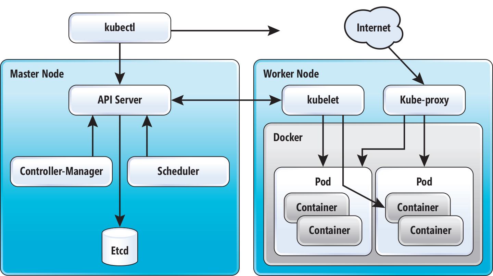

## Kiến trúc và các thành phần trong K8S
Phần này sẽ mô tả về kiến trúc và các thành phần trong K8S. Muốn hiểu phần này được tốt nhất thì nên đọc phần bài về [giới thiệu K8S](./01.Gioithieuve_Kubernetes.md/) và [cài đặt K8S](./02.Caidat-Kubernetes.md/)

Như trong phần [cài đặt K8S](./02.Caidat-Kubernetes.md/) chúng ta có thể nhìn thấy các thành phần `kubeadm, kubelet, kube-proxy, ectd, flannet` nằm trên các node. Trong phần này ta sẽ làm rõ hơn về chúng.

Kubernetes được xếp vào một trong các orchestration tools nằm trong hệ sinh thái của container. Do vậy K8S có các thành phần để đảm bảo thực hiện được việc tự động triển khai, mở rộng và vận hành container trên các cụm cluster triển khai container.

Kubernetes có thể được triển khai trên một hoặc nhiều máy vật lý, máy ảo hoặc cả máy vật lý và máy ảo để tạo thành cụm cluster. Cụm cluster này chịu sự điều khiển của Kubernetes và sinh ra các container khi người dùng yêu cầu. Kiến trúc logic của Kubernetes bao gồm 02 thành phần chính dựa theo vai trò của các node, đó là: `Master node` và `Worker node`

- `Master node`: Đóng vai trò là thành phần Control plane, điều khiển toàn bộ các hoạt động chung và kiểm soát các container trên node `worker`. Các thành phần chính bao gồm: `API-server, Controller-manager, Schedule, Etcd`. Lưu ý: Có thể trong hình vẽ dưới bạn không nhìn thấy thành phần là docker được hiển thị ra nhưng trên `master node`  cần có docker, lý do là để chạy các thành phần của K8S trên các container.

- Worker node: Vai trò chính của `worker node` là môi trường để chạy các container mà người dùng yêu cầu, do vậy thành phần chính của `worker node` bao gồm: `kubelet, kube-proxy` và chắc chắn là `Docker`

Thường thì khi triển khai thực tế thì số lượng `node worker` sẽ nhiều hơn số lượng `node master`. Do vậy node master hay chính xác là K8S cần hoàn thành tốt nhiệm vụ liên quan tới việc quản lý, xử lý các container sao cho linh hoạt trên các node worker một các hoàn hảo nhất. Ngoài ra, nếu như với các mô hình thực tế cần có khả năng `High Availability` thì chúng ta cần triển khai nhiều `node master`

